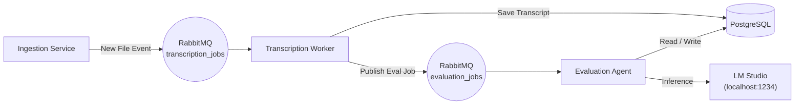

# AI Call Quality Evaluation POC

This project implements an end-to-end automated pipeline for evaluating customer service calls. It ingests audio files, transcribes them using OpenAI's Whisper model locally, and then uses an agentic LLM (via LM Studio) to evaluate the call quality against a defined framework.

## 🏗️ Architecture and Data Flow

The system follows an event-driven architecture using RabbitMQ for orchestration and PostgreSQL for structured storage.



### Components
1.  **Ingestion Service** (`src/services/ingestion.py`): Monitors the `data/` directory for new `.mp3` or `.wav` files. Publishes jobs to RabbitMQ.
2.  **Transcription Worker** (`src/services/transcription.py`): Consumes transcription jobs, runs Whisper locally to transcribe audio, and saves the transcript to the DB.
3.  **Evaluation Agent** (`src/agents/eval_agent.py`): Consumes evaluation jobs, retrieves the transcript, and uses a local LLM (via LM Studio) to score the call based on greeting, empathy, compliance, etc.
4.  **Database** (`src/db/init.sql`): Stores call metadata, full transcripts, prompts and structured evaluation results.
5.  **RabbitMQ** (`src/clients/rabbitmq_client.py`): Manages message queues for job distribution.

## 🚀 Prerequisites

Before running the project, ensure you have the following installed:

-   **Docker Desktop** (for RabbitMQ and PostgreSQL)
-   **Python 3.10+**
-   **FFmpeg** (Required for Whisper audio processing)
    -   *Windows*: `winget install ffmpeg` or download from [ffmpeg.org](https://ffmpeg.org/) and add to PATH.
-   **LM Studio** (or any OpenAI-compatible local LLM server)
    -   Download from [lmstudio.ai](https://lmstudio.ai/).
    -   Load a model (e.g., `Llama 3` or `Mistral`).
    -   **Start the Local Server** on port `1234`.

## 🛠️ Setup

1.  **Clone the repository** and navigate to the project root.

2.  **Start Infrastructure**:
    Run the Docker containers for RabbitMQ and PostgreSQL.
    ```bash
    docker-compose up -d
    ```

3.  **Install Python Dependencies**:
    ```bash
    pip install -r requirements.txt
    ```
4. **Create a `.env` file** in the root directory with the following variables:
    ```bash
    DATA_PATH=path-to-folder-containing-audio-files
    TRANSCRIPTION_MODEL=base
    LLM_BASE_URL=http://localhost:1234/v1
    LLM_API_KEY=lm-studio
    ```

## 🏃 Usage

It is recommended to run each service in a separate terminal window to see the logs.

**Terminal 1: Ingestion Service**
Monitors the `data/` folder for new files.
```bash
python -m src.services.ingestion
```

**Terminal 2: Transcription Worker**
Processes audio-to-text.
```bash
python -m src.services.transcription
```

**Terminal 3: Evaluation Agent**
Analyzes the text for quality assurance.
```bash
python -m src.agents.eval_agent
```

### Triggering a Workflow
Simply drop an audio file (`.mp3` or `.wav`) into the `data/` directory.

1.  **Ingestion** detects the file and sends a job.
2.  **Transcription** picks it up, transcribes it, and saves it to the `transcripts` table.
3.  **Evaluation** reads the transcript, queries LM Studio, and saves the score to the `evaluations` table.

## 📊 Database Schema

-   **`calls`**: Tracks the status of each file (`TRANSCRIPTION_QUEUE`, `EVALUATION_QUEUE`, `EVALUATED`, `FAILED`).
-   **`transcripts`**: Stores the raw text and JSON segments with timestamps.
-   **`evaluations`**: Stores the structured JSON output from the LLM, including scores for specific categories (Empathy, Compliance, etc.).
-   **`prompts`**: Stores the prompts used for evaluation.

### Assumptions, trade-offs and limitations

- No support for multi-speaker separation in current Whisper config
- Failed calls(marked as `FAILED` in the `calls` table) are sent to a `failed_jobs` queue for manual intervention
- Only 2 calls were available in the dataset. Hence not a thoroughly evaluated system
- Unit tests are not implemented

### How system handles failures, retries and scaling

- Failed calls(marked as `FAILED` in the `calls` table) are sent to a `failed_jobs` queue for manual intervention
- Retries are handled by the `tenacity` library
- All services and the AI Agent can be scaled horizontally by running multiple instances of each
- Horizontal scaling of Evaluation Agent will cause a bottlenech on the LLM at some point.

